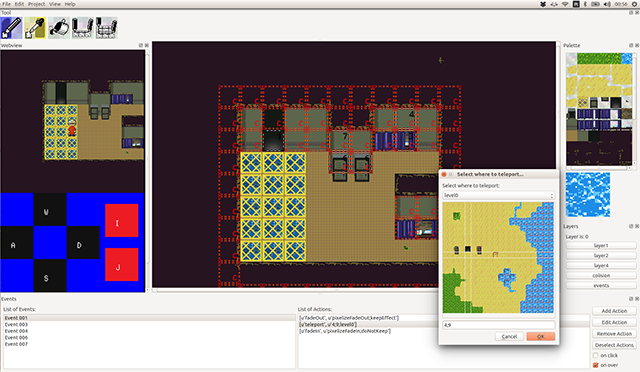

 fangamk
=============================

Maker
-----

This is the editor. It uses pyqt to render a rather nice view.
Currently the embedded tester only works in Linux, but you can test in your default browser after saving by pressing f5.

Running in Linux:
-----------------
I made using Python 2.7. Needs Pillow, Numpy and PyQt4 - you can apt-get install python-pyqt4 and similar (in Ubuntu) or use pip.
Then cd to this folder and use 
 python Editor.py 

Running in Windows:
-------------------
I've successfully tested using ActiveState ActivePyton 2.7 for Windows x86. 
I use the latest binary installer for PyQt Py2.7 and x32 windows available [here](http://www.riverbankcomputing.com/software/pyqt/download)
In windows, cd to \Python27\Scripts and use pypm: 
pypm.exe install Pillow
pypm.exe install Numpy

Then cd to this folder and use
\Python27\Python.exe Editor.py

If it doesn't work, check if the environment variable are seted: PYTHONPATH must point to C:\Python27.

Running in OSX:
---------------

I don't own an Apple computer, so I don't know if it even works there somehow. 
If it does, please be kind and share the required steps here.

