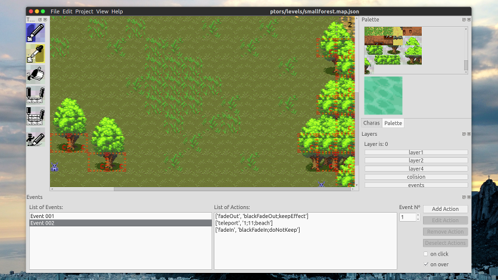

 fgmk
==========================

This is an editor for making 2D SNES era RPG like games. The games are composed
of plain text files, images and a index.html file containing [the engine](https://github.com/ericoporto/fgmkJsEngine).

The goal is that these plain text files should be easy to be read by humans and
software.

Recommended Install and Run
--------------------------

This software is available under [PyPI](https://pypi.python.org/pypi/fgmk)
as **fgmk**. For installing `pip3` in Ubuntu, use `sudo apt install python3-pip`.

    pip3 install fgmk

After install, just open a terminal and type:

    fgmk

### Windows install and run

In Windows, install Python 3 from https://www.python.org/, and then open `cmd.exe` and type (press enter after):

    python -m pip install fgmk

To run, you can type the following in `cmd.exe` or the `run...` prompt

    python -m fgmk

Alternative Installation and Running methods
--------------------------------------------

### From Source Installation

Clone this repository, meet the dependencies and install this with pip3.

    git clone https://github.com/ericoporto/fgmk.git
    cd fgmk
    pip3 install .

### Running from source

Clone this repository, meet the dependencies and type `python3 -m fgmk`

    git clone https://github.com/ericoporto/fgmk.git
    cd fgmk
    python3 -m fgmk

Dependencies
------------

This tool is written using Python 3. Needs `pillow`, `numpy` and `PyQt5` -
you can `apt install python3-pyqt5` and similar (in Ubuntu) or use pip.

If you satisfy all dependencies you don't need to install, and [can run from source](#running-from-source).

Experimental compatibility to python2 (2.7 and on) is added to versions above
0.3.0 .

Known Issues with PyQt5 in Ubuntu
---------------------------------

### Application has no keyboard shortcuts

If instead of using pip3 you are installing dependencies using `apt install`,
the menu will be nicely integrated. Unfortunately, keyboard shortcuts won't
work.

[Details in the bug here](https://bugs.launchpad.net/appmenu-qt5/+bug/1380702)

Contributing
------------

Please take a look to the [`CONTRIBUTING.md`](CONTRIBUTING.md) file.

Author
------

Made by Érico Vieira Porto

License
-------

Distributed under GPLv2 license. See [`LICENSE`](LICENSE) for more information
