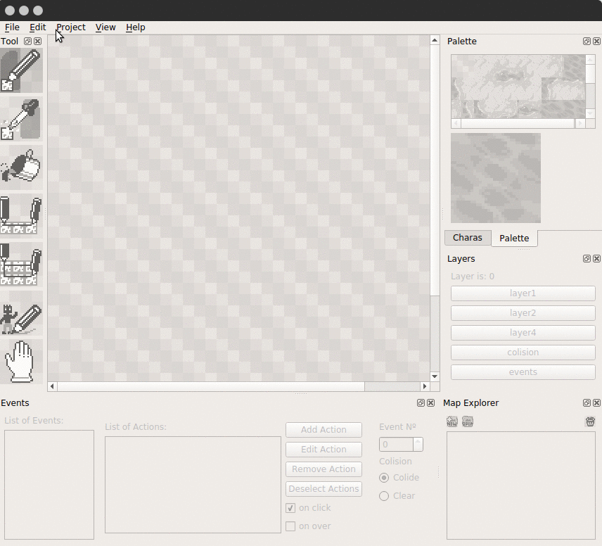
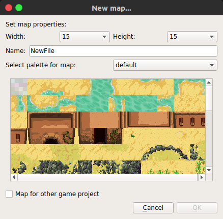
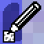
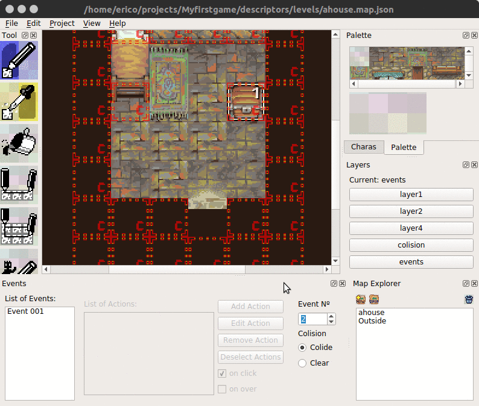

# Quickstart

If you successfully installed and loaded the Editor, you should have a screen
like the one above presented to you! Let's make a new project.

By clicking in the Project menu, you will need to provide a place where you will
keep your projects, and the name of the specific project (the game) you are
building.

Let's create an additional map, this will be the outside of this house.

{ width=16px } Click New in the
**Map Explorer**.
You can also use the menu and select `File -> New Map...`.

From here, you can select the map size, change it's palette, or change it's
name. Let's change the name from `NewFile` to `Outside`. After changing to
`Outside`, click Ok.

We the Outside map open, select the tiles in the **Palette** on the right and
use the **pen tool** from the **Tools** dock to draw in the map. We are going to
draw the outside of the house.

{ width=32px } *the pen tool*

When you are done, just save.

Don't worry, if you forget, you will be presented with an option to save if it's
needed.

Now, in the Map Explorer, double click in **ahouse**. If it asks if you want to save,
click yes.

The house map will be loaded again. Notice in the **Events** dock, there is a
field called **Event Nº**. Click on the up arrow button until the number `2` is
selected, or just type `2`. Now, with the **pen tool** again, click in the house
in the place that looks like an entrance.

Now, in the **List of Events**, select the `Event 002`, the List of Actions will
be enabled.

Deselect the **on click** checkbox and select the **on over**
checkbox. Click in Add Action, and select teleport.

We are going to select the Outside and mark a place in front of the door. Click
OK.

Ok, now we made a second map, and connected them using a teleport action. Let's
test. You can click **Project->Save and Run Project** or just press **f5**.

Hopefully, the current map will be saved and a browser will open, loading the
map. Going out of the door should land you in front of the sand house.

In the future there will be more tutorials, but for now, you are free to explore
the interface.
